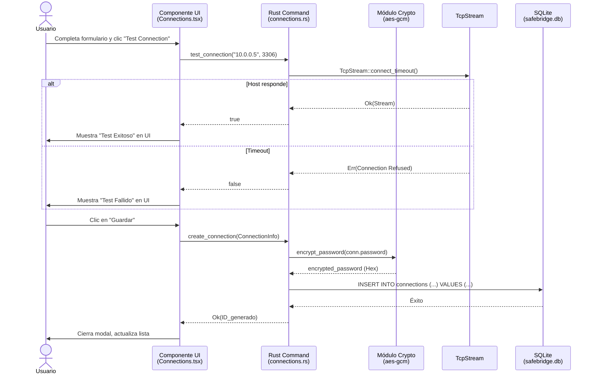
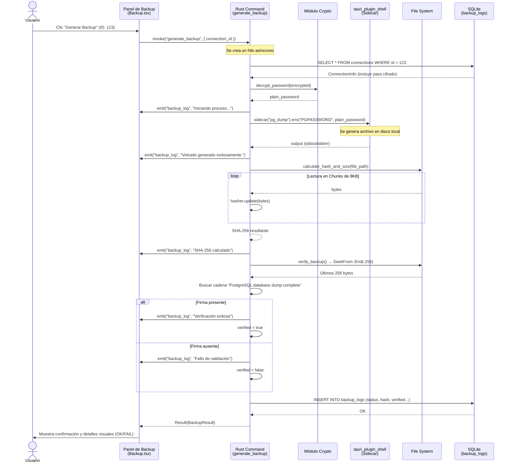

<center>


**UNIVERSIDAD PRIVADA DE TACNA**

**FACULTAD DE INGENIERÍA**

**Escuela Profesional de Ingeniería de Sistemas**

**Proyecto: *SafeBridge: Orquestador Multi-Motor de Respaldos y Validación de Integridad***

Curso: *Base de Datos II*

Docente: *Ing. Patrick José Cuadros Quiroga*

Integrantes:

***Sierra Ruiz, Iker Alberto (2023077090)***

***Cortez Mamani, Julio Samuel (2023077283)***

**Tacna – Perú**

***2026***

</center>

<div style="page-break-after: always; visibility: hidden"></div>

Sistema *SafeBridge*

Historias de Usuario y Escenarios de Prueba — FD03

Versión *2.0*

| CONTROL DE VERSIONES | | | | | |
|:---:|:---|:---|:---|:---|:---|
| Versión | Hecha por | Revisada por | Aprobada por | Fecha | Motivo |
| 1.0 | IASR / JSCM | Ing. P. Cuadros | Ing. P. Cuadros | 12/04/2026 | Versión Original |
| 2.0 | IASR / JSCM | Ing. P. Cuadros | Ing. P. Cuadros | 31/05/2026 | Actualización para Rust MVP Architecture |

<div style="page-break-after: always; visibility: hidden"></div>

# ÍNDICE GENERAL

- [1. Historias de Usuario](#1-historias-de-usuario)
- [2. Criterios de Aceptación](#2-criterios-de-aceptación)
- [3. Escenarios de Prueba (Gherkin)](#3-escenarios-de-prueba-gherkin)
- [4. Diagramas de Secuencia](#4-diagramas-de-secuencia)

<div style="page-break-after: always; visibility: hidden"></div>

---

## 1. Historias de Usuario

Las siguientes historias de usuario han sido derivadas directamente de las funcionalidades implementadas en el código fuente de SafeBridge MVP (frontend en React y backend en Tauri/Rust).

---

### HU-01 — Gestión Centralizada de Conexiones de Base de Datos

**Identificador**: HU-01  
**Módulo**: Conexiones  
**Prioridad**: Alta  
**Estimación**: 5 puntos de historia

> **Como** desarrollador de software que trabaja con diferentes motores,  
> **quiero** registrar, editar y listar las credenciales de mis servidores de base de datos en una interfaz unificada,  
> **para** no tener que ingresar contraseñas y parámetros en la terminal repetidamente al momento de requerir un backup.

**Referencia de código**: `src/pages/Connections.tsx` → UI, `src-tauri/src/connections.rs` → `create_connection()`, `list_connections()`.

---

### HU-02 — Prueba Rápida de Conectividad a la Base de Datos

**Identificador**: HU-02  
**Módulo**: Conexiones  
**Prioridad**: Media  
**Estimación**: 2 puntos de historia

> **Como** desarrollador que ha configurado un nuevo servidor de base de datos,  
> **quiero** poder probar la conectividad de red con el host y el puerto directamente desde la aplicación,  
> **para** asegurarme de que el servidor está alcanzable antes de intentar ejecutar operaciones críticas como un volcado.

**Referencia de código**: `src-tauri/src/connections.rs` → `test_connection()` empleando `TcpStream::connect_timeout`.

---

### HU-03 — Generación de Volcados Multi-Motor

**Identificador**: HU-03  
**Módulo**: Orquestador de Backups  
**Prioridad**: Crítica  
**Estimación**: 8 puntos de historia

> **Como** usuario preocupado por la integridad de sus datos,  
> **quiero** generar archivos de copia de seguridad seleccionando simplemente el motor y la conexión,  
> **para** que el sistema orqueste automáticamente la ejecución del cliente nativo (`pg_dump`, `mysqldump`, etc.) y me envíe el registro del progreso en tiempo real.

**Referencia de código**: `src-tauri/src/backup.rs` → `generate_backup()`, uso de `app.shell().sidecar()`, y `emit_log_and_record()`.

---

### HU-04 — Validación Nativa de Integridad del Archivo

**Identificador**: HU-04  
**Módulo**: Validación de Integridad  
**Prioridad**: Alta  
**Estimación**: 5 puntos de historia

> **Como** sistema orquestador de copias de seguridad,  
> **quiero** calcular el hash SHA-256 del archivo recién generado y leer sus últimos bytes para verificar la firma de conclusión del motor (EOF),  
> **para** certificar que el archivo resultante no está corrupto ni truncado por una interrupción en el proceso.

**Referencia de código**: `src-tauri/src/backup.rs` → `verify_backup()`, `calculate_hash_and_size()` utilizando `sha2`.

---

### HU-05 — Cifrado Local de Credenciales (AES-256)

**Identificador**: HU-05  
**Módulo**: Seguridad  
**Prioridad**: Alta  
**Estimación**: 5 puntos de historia

> **Como** usuario que registra credenciales sensibles de producción,  
> **quiero** que mis contraseñas sean encriptadas de forma transparente antes de ser guardadas en disco y nunca expuestas en texto plano en la interfaz,  
> **para** proteger mi acceso en caso de compromiso físico del archivo de la base de datos local SQLite.

**Referencia de código**: `src-tauri/src/crypto.rs` → `encrypt_password()`, `decrypt_password()`, omitiendo el password en `list_connections()`.

---

### HU-06 — Auditoría e Historial de Backups

**Identificador**: HU-06  
**Módulo**: Historial y Dashboard  
**Prioridad**: Media  
**Estimación**: 3 puntos de historia

> **Como** usuario que busca tener control sobre la política de respaldos,  
> **quiero** visualizar un historial inmutable de todos los backups generados, indicando tiempos de ejecución, estado y validación,  
> **para** mantener una auditoría técnica completa sin depender de investigar carpetas del sistema operativo.

**Referencia de código**: `src/pages/History.tsx`, `src-tauri/src/db.rs` → tabla `backup_logs`, `logs.rs` → `list_logs()`.

---

## 2. Criterios de Aceptación

### CA-01 — Gestión y Cifrado de Conexiones

| ID | Criterio | Condición de éxito |
|:--:|:---------|:-------------------|
| CA-01-1 | Las contraseñas insertadas se cifran mediante AES-GCM antes del `INSERT` en SQLite | `crypto::encrypt_password(&password)` no falla, el campo en la tabla luce ilegible. |
| CA-01-2 | El comando `list_connections` no retorna la contraseña en el struct enviado a React | El campo `password` de `ConnectionInfo` se serializa como `null`. |
| CA-01-3 | El UUID generado es único | No existen conflictos `PRIMARY KEY` en la tabla `connections`. |

### CA-02 — Ejecución del Sidecar (Backup)

| ID | Criterio | Condición de éxito |
|:--:|:---------|:-------------------|
| CA-02-1 | El nombre de archivo autogenerado respeta el patrón configurado | Sigue el formato `{database_name}_{timestamp}.{ext}` con la extensión propia del motor. |
| CA-02-2 | La contraseña se inyecta en variables de entorno o STDIN de forma temporal segura | Se usa `.env("PGPASSWORD", password)` en Tauri Shell, evitando pasar claves legibles a través de argumentos de comando PS (PowerShell). |
| CA-02-3 | Los logs del proceso se envían al frontend en tiempo real | El evento `backup_log` es emitido continuamente a la ventana de Tauri mediante `emit()`. |

### CA-03 — Validación de Integridad (EOF)

| ID | Criterio | Condición de éxito |
|:--:|:---------|:-------------------|
| CA-03-1 | Archivo de PostgreSQL debe contener firma final correcta | Lectura de los últimos 256 bytes incluye "PostgreSQL database dump complete". |
| CA-03-2 | Archivo de MySQL debe contener firma final correcta | Lectura de los últimos 256 bytes incluye "Dump completed on". |
| CA-03-3 | El SHA-256 generado coincide de forma inmutable con el archivo físico | `hex::encode(hasher.finalize())` es almacenado exitosamente en el registro de `BackupResult`. |

---

## 3. Escenarios de Prueba (Gherkin)

### Escenario 1 — Verificación nativa de integridad de un backup exitoso de PostgreSQL

```gherkin
Feature: Validación nativa de terminación (EOF) del archivo de volcado
  Como motor de orquestación (Rust)
  Quiero leer los bytes finales de un backup SQL
  Para verificar que el volcado no terminó de forma abrupta

  Background:
    Given que el sidecar `pg_dump` ha sido ejecutado
    And ha producido un archivo "clientes_db_20260531.sql" de 15 MB
    And el proceso retornó un Exit Status igual a 0

  Scenario: El archivo tiene la firma completa de pg_dump
    Given la función verify_backup() abre el archivo resultante
    When el lector de Rust (SeekFrom::End) inspecciona los últimos 256 bytes
    Then detecta la cadena "PostgreSQL database dump complete" en la memoria del búfer
    And el resultado devuelto de la verificación es `True`
    And el log en el dashboard muestra "Verificación exitosa: Se encontró firma de pg_dump válida."
```

---

### Escenario 2 — Fallo en conexión y registro auditable del error

```gherkin
Feature: Captura de errores de sidecars
  Como sistema de orquestación
  Quiero capturar y registrar un error de los procesos externos
  Para alertar al usuario y mantener la consistencia del log

  Scenario: Credenciales incorrectas ocasionan fallo del volcado de MySQL
    Given el usuario posee una conexión "MySQL_PROD" con una contraseña equivocada
    When el usuario pulsa "Generar Backup" en la interfaz
    Then el comando Tauri ejecuta `mysqldump` inyectando la clave errónea
    And `mysqldump` falla arrojando código de error distinto a 0 en el sistema operativo
    And Rust lee la salida `stderr` arrojando "Access denied for user"
    And se inserta un registro en la tabla SQLite `backup_logs`
    And el campo `status` del registro es "FAIL"
    And el campo `error_message` incluye "Access denied"
```

---

### Escenario 3 — Test de Conectividad con el Servidor Destino

```gherkin
Feature: Comprobador de conectividad rápido
  Como sistema
  Quiero comprobar si puedo alcanzar la red del motor de base de datos
  Para prevenir el inicio inútil de comandos de backup.

  Scenario: El host de base de datos se encuentra inactivo
    Given el usuario ha creado una conexión donde host = "192.168.1.100" y port = 5432
    And el servidor alojado en esa IP se encuentra apagado
    When el usuario pulsa el botón "Test de Conexión"
    And Rust ejecuta `TcpStream::connect_timeout("192.168.1.100:5432")` con un timeout de 3 segundos
    Then la conexión hace timeout devolviendo un Error (Err)
    And la interfaz React muestra una alerta "Connection failed" en color rojo
```

---

## 4. Diagramas de Secuencia

### 4.1. Creación Segura de Conexión y Prueba de Red

Este diagrama muestra cómo se transmite una contraseña desde la vista de React y se asegura utilizando AES antes de impactar en SQLite.



---

### 4.2. Flujo de Generación de Backup y Validación

El proceso más crítico del orquestador, mostrando el ciclo asíncrono y la verificación nativa EOF.


