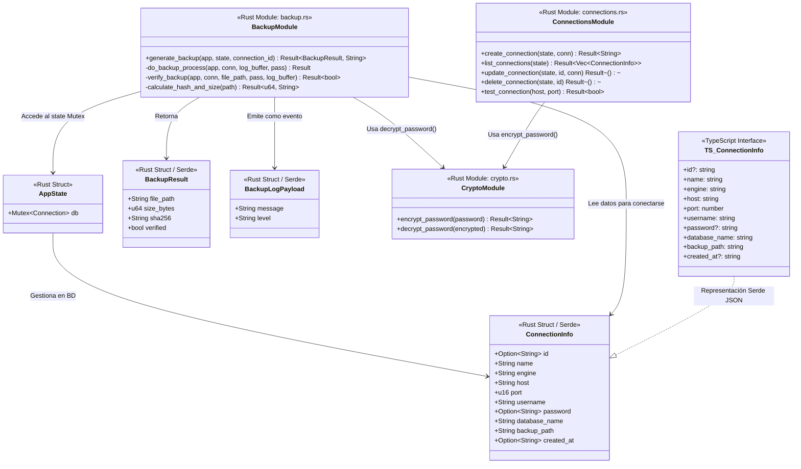
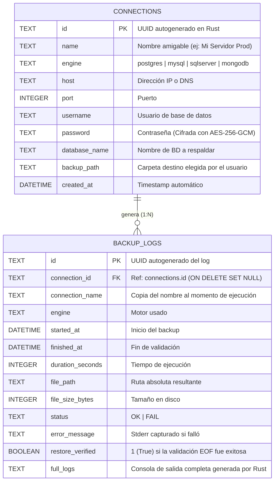
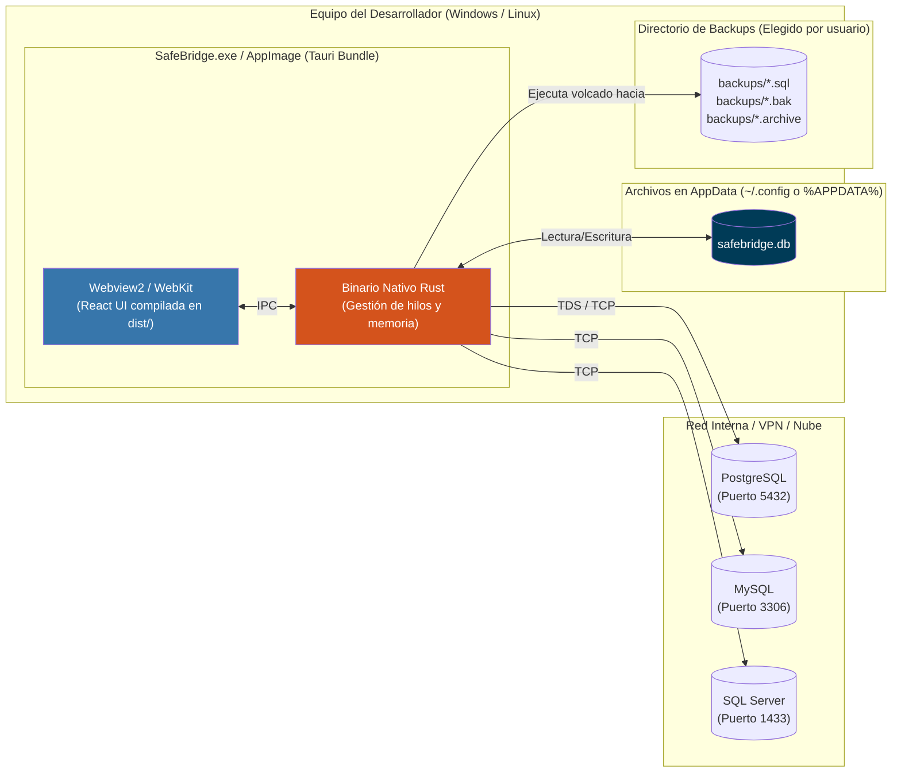
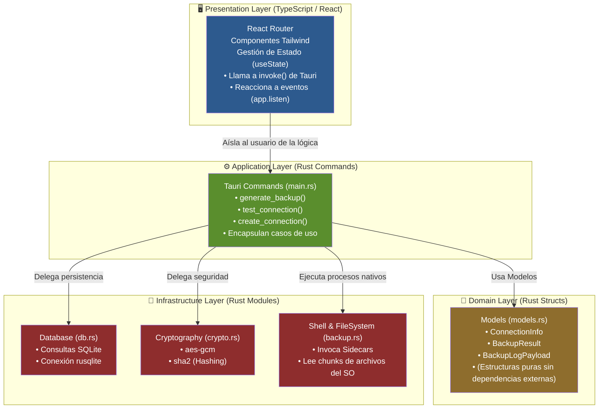
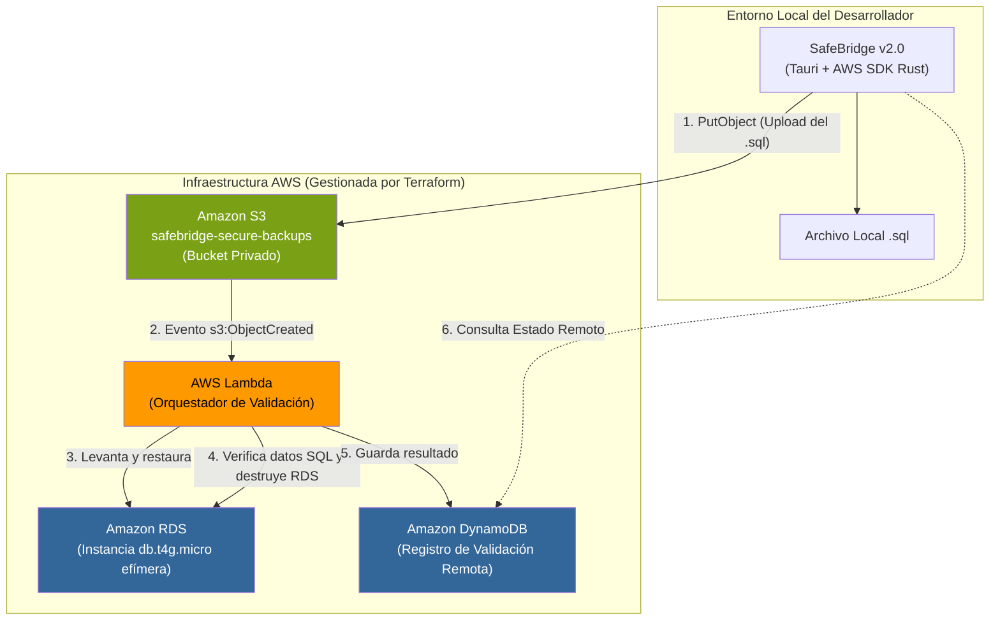

<center>


**UNIVERSIDAD PRIVADA DE TACNA**

**FACULTAD DE INGENIERÍA**

**Escuela Profesional de Ingeniería de Sistemas**

**Proyecto: *SafeBridge: Orquestador Multi-Motor de Respaldos y Validación de Integridad***

Curso: *Base de Datos II*

Docente: *Ing. Patrick José Cuadros Quiroga*

Integrantes:

***Sierra Ruiz, Iker Alberto (2023077090)***

***Cortez Mamani, Julio Samuel (2023077283)***

**Tacna – Perú**

***2026***

</center>

<div style="page-break-after: always; visibility: hidden"></div>

Sistema *SafeBridge*

Diagramas de Arquitectura (Ingeniería Inversa) — FD04

Versión *2.0*

| CONTROL DE VERSIONES | | | | | |
|:---:|:---|:---|:---|:---|:---|
| Versión | Hecha por | Revisada por | Aprobada por | Fecha | Motivo |
| 1.0 | IASR / JSCM | Ing. P. Cuadros | Ing. P. Cuadros | 20/04/2026 | Versión Original |
| 2.0 | IASR / JSCM | Ing. P. Cuadros | Ing. P. Cuadros | 31/05/2026 | Actualización para Tauri/Rust Architecture |

<div style="page-break-after: always; visibility: hidden"></div>

# ÍNDICE GENERAL

- [1. Diagrama de Clases / Estructuras](#1-diagrama-de-clases--estructuras)
- [2. Diagrama de Base de Datos](#2-diagrama-de-base-de-datos)
- [3. Diagrama de Componentes](#3-diagrama-de-componentes)
- [4. Diagrama de Despliegue](#4-diagrama-de-despliegue)
- [5. Diagrama de Arquitectura](#5-diagrama-de-arquitectura)
- [6. Diagrama de Infraestructura (Terraform Cloud)](#6-diagrama-de-infraestructura-terraform-cloud)

<div style="page-break-after: always; visibility: hidden"></div>

> **Nota metodológica**: Todos los diagramas de este documento han sido generados mediante **ingeniería inversa** del código fuente del repositorio `safebridge`. Los elementos representados corresponden exclusivamente a las estructuras en Rust (`src-tauri/src`) y TypeScript (`src/`) presentes en el código real.

---

## 1. Diagrama de Clases / Estructuras

El siguiente diagrama ilustra cómo las estructuras de datos (Structs) de Rust interactúan y se exponen al frontend como interfaces en TypeScript. Al usar Rust, las "clases" no existen per se, por lo que se representan los `Structs` y sus funciones implícitas (impl blocks) o comandos Tauri asociados.



---

## 2. Diagrama de Base de Datos

SafeBridge utiliza persistencia local mediante **SQLite** (`rusqlite`) contenida en el archivo `safebridge.db`. El código SQL de creación se encuentra en `src-tauri/src/db.rs`.



---

## 3. Diagrama de Componentes

Este diagrama refleja la arquitectura híbrida Tauri, con comunicación IPC entre React y Rust, y Rust interactuando con los binarios del sistema operativo (Sidecars).

```mermaid
graph TB
    subgraph "Frontend (Webview)"
        subgraph "React UI"
            APP["App.tsx\n(Router principal)"]
            SB["Sidebar.tsx"]
            P_DASH["Dashboard.tsx"]
            P_CONN["Connections.tsx"]
            P_BACK["Backup.tsx"]
            P_HIST["History.tsx"]
        end
        TAURI_API["@tauri-apps/api\n(core, event)"]

        APP --> SB
        APP --> P_DASH
        APP --> P_CONN
        APP --> P_BACK
        APP --> P_HIST
        P_CONN --> TAURI_API : invoke()
        P_BACK --> TAURI_API : invoke(), listen()
        P_HIST --> TAURI_API : invoke()
    end

    subgraph "Backend (Rust Core)"
        TAURI_IPC["Tauri IPC Router\n(generate_handler!)"]
        
        MOD_CONN["connections.rs\n(CRUD, TcpStream test)"]
        MOD_BACK["backup.rs\n(Orquestador, EOF check, SHA2)"]
        MOD_LOG["logs.rs\n(Read logs, Stats)"]
        MOD_CRYPTO["crypto.rs\n(aes-gcm encryption)"]
        MOD_DB["db.rs\n(rusqlite engine)"]

        TAURI_API <-->|"JSON over IPC"| TAURI_IPC
        TAURI_IPC --> MOD_CONN
        TAURI_IPC --> MOD_BACK
        TAURI_IPC --> MOD_LOG

        MOD_CONN --> MOD_CRYPTO
        MOD_BACK --> MOD_CRYPTO
        
        MOD_CONN --> MOD_DB
        MOD_BACK --> MOD_DB
        MOD_LOG --> MOD_DB
    end

    subgraph "Operating System Layer"
        SQLITE[("safebridge.db\n(SQLite)")]
        FS[("File System\n(Rutas destino)")]
        
        subgraph "Tauri Sidecars (Binarios nativos)"
            PGDUMP["pg_dump.exe"]
            MYSQLDUMP["mysqldump.exe"]
            SQLCMD["sqlcmd.exe"]
        end
        
        EXT_DB[("Servidor BD Remoto\n(PostgreSQL, MySQL, etc.)")]
    end

    MOD_DB --> SQLITE
    MOD_BACK -->|"tauri_plugin_shell"| PGDUMP
    MOD_BACK -->|"tauri_plugin_shell"| MYSQLDUMP
    MOD_BACK -->|"tauri_plugin_shell"| SQLCMD
    
    MOD_BACK -->|"Calcula Hash y lee EOF"| FS
    PGDUMP -->|"Escribe .sql"| FS
    
    PGDUMP -->|"Descarga datos vía TCP/IP"| EXT_DB
    MOD_CONN -->|"Testea puerto (TcpStream)"| EXT_DB
```

---

## 4. Diagrama de Despliegue



---

## 5. Diagrama de Arquitectura

El proyecto adopta los principios de **Clean Architecture**, aunque al ser una aplicación Tauri pequeña la organización está dictada por módulos. La "interfaz" que divide las capas está impuesta físicamente entre Node.js (Vite) y Rust (Tauri).



---

## 6. Diagrama de Infraestructura (Terraform Cloud)

> **Contexto:** Aunque el MVP de SafeBridge funciona en local, este diagrama responde al Análisis Económico de Cloud (`FD01-Informe-Factibilidad.md`), ilustrando cómo se puede extender la validación de backups hacia AWS usando Terraform. 

La idea es que una versión futura de SafeBridge suba automáticamente el backup a un S3 Bucket. Una función Lambda detectaría el archivo y levantaría temporalmente una base de datos Amazon RDS para restaurar el archivo, validarlo profundamente, emitir el resultado y autodestruirse.



---

*Documento generado por el equipo BitCraft Solutions — Universidad Privada de Tacna, FAING-EPIS, Ciclo 2026-I.*
